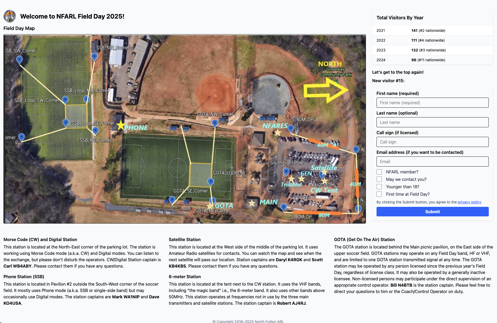

# Field Day Registration Kiosk

A simple, robust visitor registration kiosk for Amateur Radio Field Day events. Originally built for the North Fulton Amateur Radio League ([NFARL](https://nfarl.org)), this project has evolved into a sandbox for experimenting with new ideas and development approaches.

---

## Features

- Simple visitor registration for Field Day events
- Offline operation with real-time clock support
- Embedded templates and static files for easy deployment
- User-friendly web interface with mobile support (now with Tailwind CSS)
- Post-event data export (HTML and CSV for SQLite)
- Morse code playback for visitor callsigns
- Systemd service integration for kiosk mode
- Designed for Raspberry Pi, Orange Pi, and other single-board computers

---

## Screenshot



---

## Deployment

The application is usually deployed on a Raspberry Pi or compatible boards. It can also be deployed on any other computer that you can leave unattended in the park overnight.

### Prerequisites

- Linux OS (any recent version will do)
- Go 1.22 and higher
- Git CLI
- `sudo` access on the target host

### Build with Makefile

1. Clone this repo on the target computer and `cd` into that directory.
2. Run `make build`. That will create a binary in the root directory.
3. Test it by running `./fieldday test.db`.
   Open the browser with the URL `http://localhost:8080` and enter one or two visitors.
   Check if they were added to the database by adding `/list` to the main URL (instead of `/new`).

---

### Build with GoReleaser

This project uses [GoReleaser](https://goreleaser.com/) to automate building and packaging binaries for multiple platforms.

#### Prerequisites

- [GoReleaser](https://goreleaser.com/install/) installed (`brew install goreleaser` on macOS, or see the [official docs](https://goreleaser.com/install/) for other platforms)
- Go 1.18 or newer installed
- (Optional) GitHub CLI (`gh`) for creating releases

#### Building Locally (Test Mode)

To build and package the binaries locally without publishing a release, run:

```sh
goreleaser release --snapshot --clean
```

This will:

- Build binaries for Linux x86_64, Linux ARMv7, and macOS ARM64
- Package them into tar.gz archives in the `dist/` directory

#### Creating a Release

To create a full release and publish it to GitHub:

1. Commit all your changes and tag your release:

   ```sh
   git tag v1.0.0  # Replace with your version
   git push origin v1.0.0
   ```

2. Run GoReleaser:

   ```sh
   goreleaser release --clean
   ```

   This will:
   - Build and package binaries for all supported platforms
   - Create a GitHub release and upload the archives and checksums

> **Note:** You need a `GITHUB_TOKEN` environment variable set with permissions to create releases. You can generate a token in your GitHub account settings.

#### Customizing the Build

You can adjust the build targets and included files by editing the `.goreleaser.yaml` file in the project root.

---

## Install

1. Run `make install`. That will copy the binary to `/opt/fieldday`. The binary includes all templates and static files embedded.
2. Run `make user`. That will create a user named `nfarl` with the password `fieldday` and configure their environment (e.g., autostart of the browser in full screen mode, etc.).
   - Note: The script works with the Raspbian OS and LXDE desktop. In the 2024 deployment, I used Orange Pi Zero 3 with Debian 12 (Bookworm) and XFCE4. Setting the browser properly required some manual steps that I haven't automated yet.

### Upgrade

1. `git pull`
2. `make build`
3. `make install`

---

## Post-event Processing

For versions before 2024, I used SQLite. For SQLite, use the following instructions to convert the visitor data to CSV: [https://www.sqlitetutorial.net/sqlite-export-csv/](https://www.sqlitetutorial.net/sqlite-export-csv/)

In 2024, I switched to BoltDB and Storm, so it will require a separate tool. I'll add it later. Currently, you can use the `/list` URL to view the list of visitors in HTML format.

---

## Development History

I originally started this project to learn Django (a Python web development framework). The Django versions can be found here: [https://github.com/pavelanni/field_day](https://github.com/pavelanni/field_day) and [https://github.com/pavelanni/field_day3](https://github.com/pavelanni/field_day3)

### Field Day 2021

I used Jon Calhoun's course ([https://www.usegolang.com/](https://www.usegolang.com/)) and created the first version of the application. This version used the Model-View-Controller approach, Gorilla web framework, and SQLite as a database with GORM.

### Field Day 2022

I decided to simplify the application and switched from Gorilla to `net/http` from the standard library. My application is extremely simple, so it's not worth using a full-fledged web framework. I also simplified the application structure, switching from MVC to a much simpler architecture. I'm still using `gorilla/schema` to parse the form.

I started using GitHub Actions to test and build the binary.

### Field Day 2023

I added a `systemd` service that would start the registration server and added those steps to the Makefile.

After FD 2022, I discovered that creation timestamps in the database were a bit off and figured out that the computer was turned off for the night and couldn't get the correct time because there was no network in the field. I decided to add a real-time clock (with a battery) to the installation.

#### Real-time Clock

The program adds timestamps to each visitor record automatically. But in the field, the host doesn't have any network connection, so if somebody turns it off, the timestamps will be all wrong after that. To avoid such a situation, you can add a simple battery-powered real-time clock (RTC) to the Raspberry Pi and configure it accordingly.

This is the one I added to my installation: [https://www.amazon.com/Makerfire%C2%AE-Raspberry-Module-DS1307-Battery/dp/B00ZOXWHK4/](https://www.amazon.com/Makerfire%C2%AE-Raspberry-Module-DS1307-Battery/dp/B00ZOXWHK4/)

This is a good instruction on how to configure it: [https://pimylifeup.com/raspberry-pi-rtc/](https://pimylifeup.com/raspberry-pi-rtc/).

For Debian installation, I found good advice here: [https://forum.armbian.com/topic/8838-external-rtc-ds1307-usage/](https://forum.armbian.com/topic/8838-external-rtc-ds1307-usage/)

```none
did you insert

rtc-ds1307
in /etc/modules?

and

echo ds1307 0x68 > /sys/class/i2c-adapter/i2c-3/new_device  # I changed it to i2c-3 for my Orange Pi device
hwclock -s

in /etc/rc.local?
```

**2024-06-19**: After switching to Orange Pi Zero 3 with Debian 12, I had to make other changes to the RTC setup. When you add a new RTC device such as DS1307 and load its module, it creates a new device called `/dev/rtc1`. I spent some time trying to figure out why my `hwclock` was lagging my system date (several seconds per minute). After changing several different RTC boards and their batteries, I figured out the problem was not with the RTC board.

To make `hwclock` read from the new device, you should first write to that device with `hwclock -w --rtc /dev/rtc1` and then read from it with `hwclock -r --rtc /dev/rtc1`.

To configure the system time synchronization, you have to edit this file: `/usr/lib/udev/rules.d/85-hwclock.rules` and change `KERNEL==rtc0` to `KERNEL=rtc1`. Then `/usr/lib/udev/hwclock-set` will use this device to sync the system time.

### Field Day 2024

I decided to switch from SQLite to BoltDB. I started using BoltDB and Storm in a couple of projects at work, and it seemed reasonable to use it here. The main advantage is that, because it doesn't need CGO (like `go-sqlite3` does), you can:

1. Compile the project much faster
2. Cross-compile it for ARM on your laptop
3. Not need GCC anymore

I created a `visitorstore` package and put all the store operations into it. If necessary, it's easy now to create a VisitorStore interface and implementations for various databases.

### Field Day 2025

I decided to switch from Bootstrap to Tailwind CSS. I started using Bootstrap in 2021, and now it's time to move on. This made the whole site more responsive and mobile-friendly. I am going to host it on a cloud this year, in addition to the local kiosk installation.

I added a Morse code feature to the site. When a visitor is added, the program plays the Morse code of their callsign. If no callsign is provided, the program plays just **73**.

It was quite a journey with the Morse code feature. First, I added the Ebiten library to play sound locally on the Orange Pi computer. Then I thought that mobile users wouldn't be able to hear it and decided to play it in the browser. So now it generates WAV files and plays them in the browser. You can even use the `/morse-audio?callsign=YOURCALLSIGN` URL to play Morse code in the browser.
